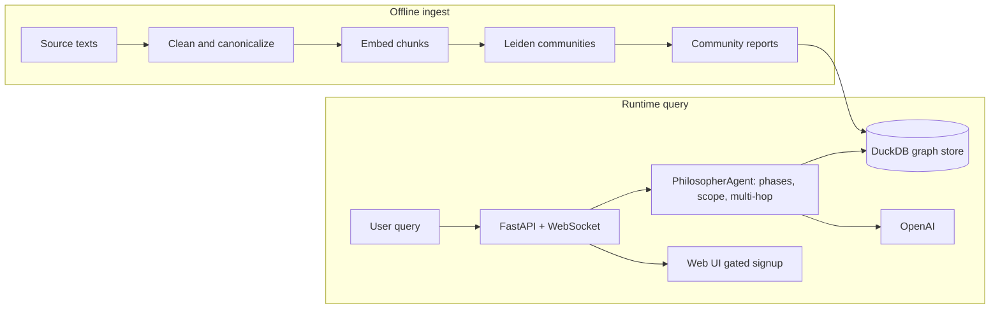

# PhilosophAI

[](https://github.com/jpalvarezb/philosophai/actions/workflows/ci.yml)


**Access:** There is **no anonymous live demo**. The UI is deployed for production (`butlerian.xyz` / `philo.butlerian.xyz`). To use PHILO-001 on Butlerian infrastructure, **[request access](https://www.butlerian.xyz/signup)** (manual review). To try PhilosophAI without an account, follow **Quick start** and run locally.

**Knowledge Graph RAG with community routing** — a GraphRAG-style system that builds a knowledge graph from philosophical texts, detects communities, and answers questions via an agent that traverses the graph and synthesizes answers with citations.

**UI:** Single-file frontend in `ui/index.html`; FastAPI serves it at `/` in production. Vite proxy for local UI dev (see `DEPLOY.md`).

## Architecture

Offline ingest builds the DuckDB-backed graph once; queries at runtime hit the stored graph plus the LLM (no Leiden re-run per request).



## Why custom agent tooling?

PhilosophAI uses a **custom agent runtime** (phases, scope, multi-hop graph traversal, citation-gated tools) instead of LangGraph or LangChain. That keeps deterministic phase transitions and graph-first reasoning without framework overhead — the DuckDB-backed graph is the main state carrier.

### GraphRAG in one paragraph

Classic RAG retrieves isolated chunks and struggles on multi-hop questions. **GraphRAG** (entity graph → community clustering, e.g. Leiden → neighborhood / community-augmented retrieval) grounds the philosopher agent in coherent subgraphs so answers can cite trails across philosophers.

## Features

- **Ingest pipeline**: Assumes **triples and source data are already in the database** (created by a separate process). The pipeline then: clean triples → canonicalize entities → embed chunks → detect communities (Leiden) → generate community reports
- **Graph storage**: DuckDB-backed storage for triples, chunks, embeddings, and community metadata
- **Agentic Q&A**: Philosopher agent with sequential thinking, phase-gated tools, and multi-hop traversal over the graph
- **REST + WebSocket API**: Query and agent endpoints, graph/communities data, export (transcript, report HTML)
- **Web UI**: Chat interface with graph visualization (static `ui/` served by backend or via separate dev server)

## Requirements

- **Python** 3.11+
- **OpenAI API key** (for embeddings, canonicalization, community summaries, and the philosopher agent)
- **DuckDB database** (path set via `PHILOSOPH_DB`); triples and source data are **created beforehand** by your own pipeline — this repo’s ingest then cleans, canonicalizes, embeds, and builds communities on top of that.

## Quick start

### 1. Clone and install

```bash
git clone <repo-url>
cd philosophai
pip install .
# Or with dev deps: pip install -e ".[dev]"
```

### 2. Environment

Copy `.env.example` to `.env` and set:

```bash
# Required
OPENAI_API_KEY=sk-...
PHILOSOPH_DB=/path/to/your/philosoph.duckdb

# Optional (defaults shown)
PHILOSOPH_ENV=development
PORT=8000
```

See `.env.example` for logging, rate limits, traversal limits, and CORS.

### 3. Ingest (build the graph)

Run the pipeline against your DuckDB file. **Triples and source data must already exist in the database** (created beforehand by your own extraction/ETL). The CLI then runs:

```bash
# Full pipeline: clean → canonicalize → embed → communities → reports
python -m src.ingest.cli --db /path/to/philosoph.duckdb --all

# Or step by step
python -m src.ingest.cli --db /path/to/philosoph.duckdb --clean
python -m src.ingest.cli --db /path/to/philosoph.duckdb --canonicalize
python -m src.ingest.cli --db /path/to/philosoph.duckdb --embed
python -m src.ingest.cli --db /path/to/philosoph.duckdb --communities
python -m src.ingest.cli --db /path/to/philosoph.duckdb --reports
```

CLI options: `--resolution`, `--min-edge-weight`, `--resolution-sweep`, `--dry-run`, etc. Run `python -m src.ingest.cli --help` for details.

### 4. Run the API server

```bash
# From project root
philosophai-server
# Or: uvicorn src.api.main:app --reload --port 8000
```

- API: http://localhost:8000  
- Health: http://localhost:8000/health  
- OpenAPI: http://localhost:8000/docs  

The app serves the UI from `/` when running in production mode; in development you can serve the `ui/` folder separately (e.g. with a static server or a Vite app if you add one) and point it at the backend.

## API overview

| Endpoint | Description |
|----------|-------------|
| `GET /health` | Liveness/readiness |
| `POST /api/query` | One-shot RAG query (answer + citations + traversal) |
| `POST /api/agent/query` | Agentic query (multi-step, conversation_id for session) |
| `POST /api/agent/reset` | Reset agent session (per conversation or shared) |
| `GET /api/agent/greeting` | Greeting message for the agent |
| `GET /api/graph` | Graph structure for visualization |
| `GET /api/communities` | List communities |
| `GET /api/communities/{id}` | Single community details |
| `POST /api/export/transcript` | Export transcript as text |
| `POST /api/export/report-html` | Export report as HTML |
| `POST /api/export/field-html` | Export field as HTML |

WebSocket endpoints are mounted under the same app for real-time agent interaction (see `src.api.ws`).

## Project layout

```
philosophai/
├── src/
│   ├── api/          # FastAPI app, routes, WebSockets, rate limit
│   ├── agents/       # Philosopher agent, tools, phases, multi-hopper, trace
│   ├── config/       # Logging, env
│   ├── graph/        # Graph build, communities, traversal, reports, conceptness
│   ├── ingest/       # CLI, cleaner, canonicalizer, embedder
│   ├── rag/          # Vector search, fusion, seeds, citations
│   ├── schema/       # Data models
│   └── storage/      # DuckDB storage
├── ui/               # Frontend (e.g. index.html + assets)
├── tests/
├── pyproject.toml
├── Dockerfile
├── entrypoint.sh     # DB download + uvicorn
├── fly.toml          # Fly.io deployment
├── .env.example
└── DEPLOY.md         # Security checklist, Fly.io commands, CORS
```

## Development

- **Tests**: Default: `pytest`. CI and local “no secrets” runs: `pytest -m "not live_integration"`. For real OpenAI + DuckDB tests: set `RUN_LIVE_INTEGRATION=1`, `OPENAI_API_KEY`, and `PHILOSOPH_DB`. Markers are defined in `pyproject.toml`; only use a marker in config if at least one test references it.
- **Formatting / lint**: Dev deps include `ruff` and `black`; repo-wide `black --check` / `ruff check` are not yet enforced in CI so existing files can be normalized in a follow-up.
- **Local CORS**: Set `PHILOSOPH_ENV=development` in `.env` so default CORS allows localhost; override with `CORS_ORIGINS` if needed.

## Deployment

- **Docker**: Build from the repo root; image runs `entrypoint.sh` (optional DB download via `DB_DOWNLOAD_URL`) then uvicorn. Set `OPENAI_API_KEY` and `PHILOSOPH_DB` (e.g. `/data/philosoph.duckdb`) via env.
- **Fly.io**: See `DEPLOY.md` for app create, volume, secrets, and CORS. Production env and CORS defaults are in `fly.toml` and `[env]`.

## License

[MIT License](LICENSE) — see `pyproject.toml` for metadata.
